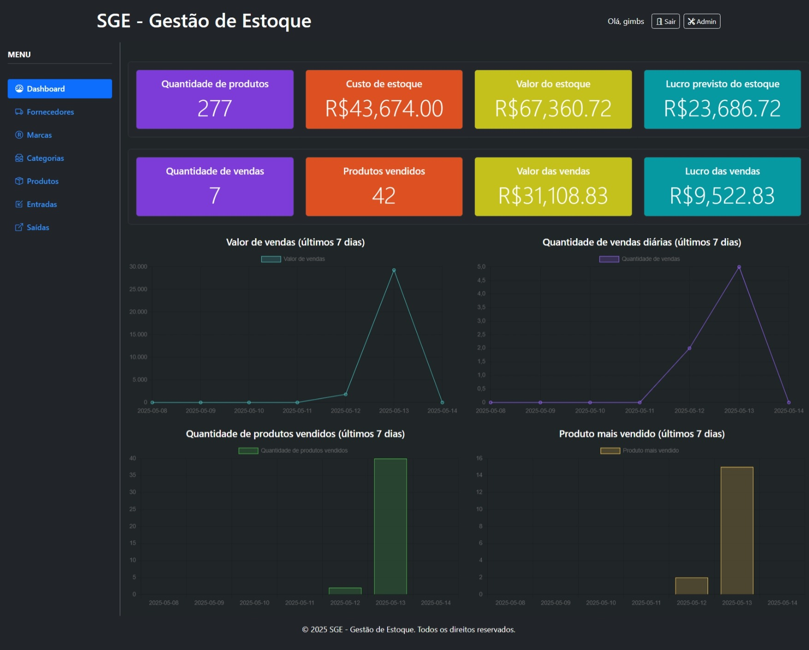
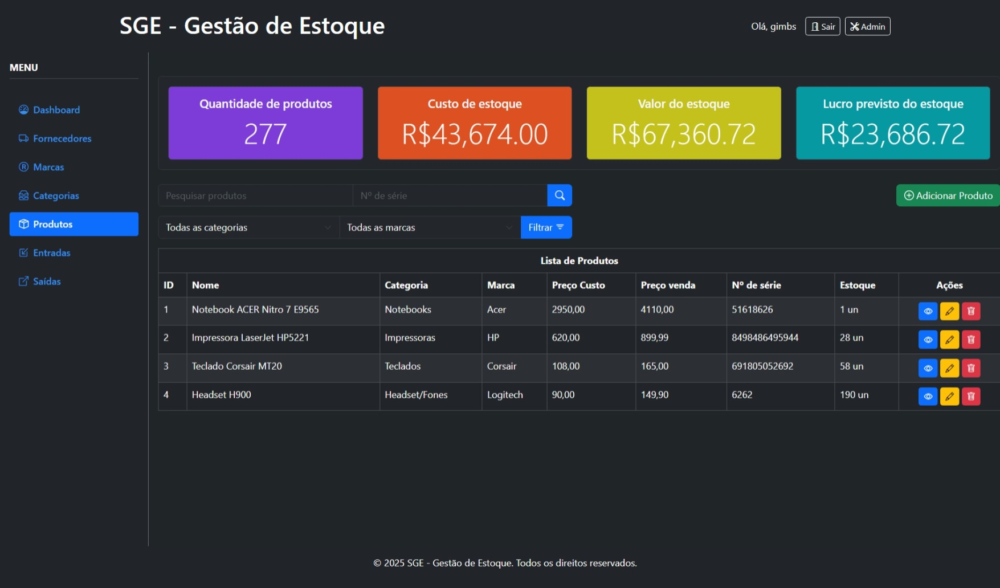
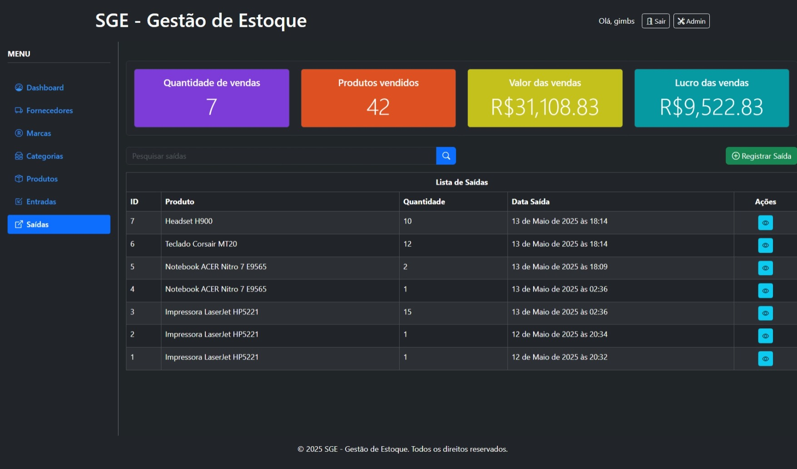

# 📊 SGE - Sistema de Gestão de Estoque


Um sistema completo para gerenciamento de estoque desenvolvido em Django, com interface moderna e recursos avançados para controle de produtos, fornecedores, entradas e saídas.

## ✨ Funcionalidades Principais

### 🏢 Gestão Empresarial Completa
- **🏷️ Marcas:** Cadastro e gerenciamento de marcas de produtos
- **📁 Categorias:** Organização de produtos em categorias personalizadas
- **📦 Produtos:** Controle de produtos com preços, estoque e detalhes completos
- **🚚 Fornecedores:** Gerenciamento de fornecedores com contatos e informações fiscais

### 📈 Controle de Estoque
- **📥 Entradas:** Registro de entrada de produtos no estoque
- **📤 Saídas:** Controle de saídas com impacto automático no estoque
- **🔄 Atualização automática:** Saldo de estoque atualizado em tempo real

### 📊 Dashboard e Relatórios
- **📊 Métricas de produtos:** Visualização de quantidade, custo e valor do estoque
- **📈 Métricas de vendas:** Acompanhamento de vendas e lucratividade
- **📉 Gráficos interativos:** Análise visual de desempenho em períodos específicos

### 🔒 Segurança e Acessos
- **👤 Controle de permissões:** Diferentes níveis de acesso por usuário
- **🔐 Autenticação segura:** Sistema de login com proteção de rotas
- **🔄 JWT Authentication:** API com autenticação via tokens JWT

## 🛠️ Tecnologias Utilizadas

-  - Framework web
-  - API REST
-  - Autenticação
-  - Frontend
-  - Banco de dados

## Screenshots








## 📦 Módulos do Sistema

| Módulo | Descrição | Ícone |
|--------|-----------|-------|
| **Dashboard** | Página inicial com métricas e gráficos | 📊 |
| **Marcas** | Gerenciamento de marcas de produtos | 🏷️ |
| **Categorias** | Organização de produtos em categorias | 📁 |
| **Produtos** | Cadastro e gestão de produtos | 📦 |
| **Fornecedores** | Gerenciamento de fornecedores | 🚚 |
| **Entradas** | Registro de entrada de produtos | 📥 |
| **Saídas** | Controle de saída de produtos | 📤 |

## 🚀 Instalação

```bash
# Clone o repositório
git clone https://github.com/seu-usuario/ERP_DjangoMaster.git
cd ERP_DjangoMaster

# Crie um ambiente virtual
python -m venv venv

# Ative o ambiente virtual
# No Windows:
.\venv\Scripts\activate
# No Linux/Mac:
# source venv/bin/activate

# Instale as dependências
pip install -r requirements.txt

# Execute as migrações
python manage.py migrate

# Crie um usuário administrador
python manage.py createsuperuser

# Inicie o servidor
python manage.py runserver
```

## 📱 Interface do Sistema

O SGE possui uma interface moderna e responsiva, utilizando Bootstrap e ícones Bootstrap Icons. O sistema é projetado com tema escuro para maior conforto visual durante o uso prolongado.

### 🎨 Paleta de Cores
-  `Azul Primário`
-  `Vermelho Alerta`
-  `Verde Sucesso`
-  `Amarelo Atenção`
-  `Fundo Escuro`

## 🔌 API REST

O sistema disponibiliza uma API REST completa para integração com outros sistemas.

``` Rotas da API
- Obtenção de token JWT
/api/token/
/api/token/refresh/
/api/token/verify/
-
/api/v1/brands/
/api/v1/categories/
/api/v1/inflows/
/api/v1/outflows/
/api/v1/products/
/api/v1/suppliers/
/api/token/ - Obtenção de token JWT
```

## 📝 Licença

Um projeto @pycodebr.